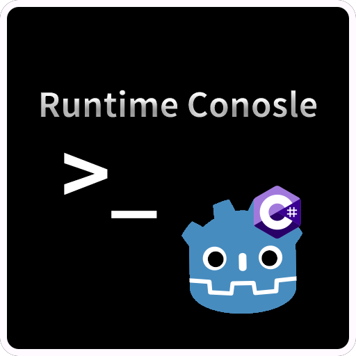

# RuntimeConsole Plugin (In-Game Console for Godot)

**[简体中文](README.md) | [English](README_en.md)**



## Overview
RuntimeConsole is a runtime console plugin for Godot .NET 4.4+ that allows developers to execute commands, view logs, and debug scene nodes and data structures in real-time during gameplay, providing great convenience for development and testing.

## Features

- Use the `~` key to toggle the console.

- Object Inspector
    
    * GDScript user script properties display support

    * One-click display of all nodes in the game and their public instance fields/properties.
    
    * Supports recursive object structure display, including fields, properties, lists, and other composite data types.
    
    * Supports keyword search with highlighted matches for easy target object location.
    
    * Supports custom display behavior:
    
        * [`[Inspectable]`](/ObjectInspectorWindow/ObjectInspectorWindow.cs/#L340) Custom field name \ display non-public or static members.

        * [`[InspectableObject]`](/ObjectInspectorWindow/ObjectInspectorWindow.cs/#L351) Include non-public and static members.

        * [`[HiddenInInspector]`](/ObjectInspectorWindow/ObjectInspectorWindow.cs/#L361) Hide specific fields or properties.
        
        * [`[HideInObjectTree]`](/ObjectInspectorWindow/ObjectInspectorWindow.cs/#L366) Exclude the class from inspector.

- Log & Command Console

    * View runtime logs in real-time (Info/Warning/Error)

    * Execute debug commands

## Requirements

- [Godot .NET 4.4+](https://godotengine.org/download/windows/)

## Installation

1. Download the `Release` version and extract it into your project.

2. Enable the plugin in `Project Settings > Plugins`.

## Adding Custom Commands

**Note: The method for adding custom commands may change in future versions**

To add custom commands, modify `ConsoleCommands.cs` to create new methods.
Each command method must:
- Accept a parameter of type `Godot.Collections.Array`.
- Handle exceptions manually.

Example:
```csharp
private void Greet(Godot.Collections.Array args)
{
    if (args.Count < 1)
    {
        Console.GameConsole.PrintNoFormattedErrorMessage("Usage: Greet <name>");
        return;
    }
    Console.GameConsole.PrintNoFormattedMessage($"Hello, {args[0]}!");
}
```

See [`ConsoleCommands.cs`](/ConsoleCommands.cs) for details.

## Notes

- Custom command mechanism will be optimized in future versions

## License

[`MIT`](https://mit-license.org/) License
